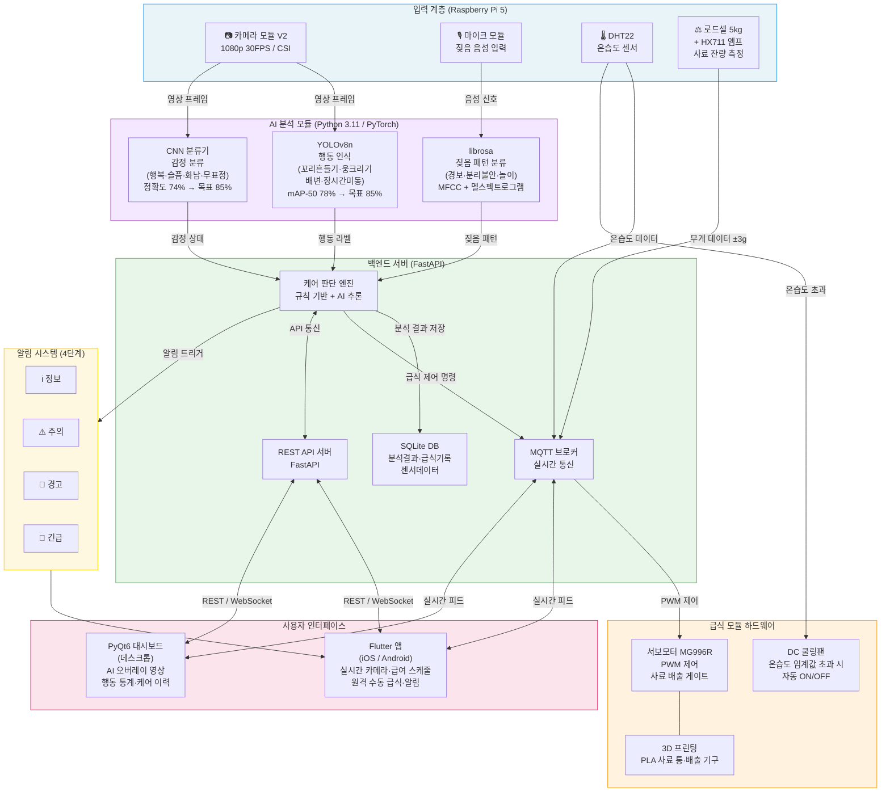

# PetMind 시스템 구성도

```mermaid
flowchart TD
    subgraph INPUT["입력 계층 (Raspberry Pi 5)"]
        CAM["📷 카메라 모듈 V2\n1080p 30FPS / CSI"]
        MIC["🎙️ 마이크 모듈\n짖음 음성 입력"]
        DHT["🌡️ DHT22\n온습도 센서"]
        LOAD["⚖️ 로드셀 5kg\n+ HX711 앰프\n사료 잔량 측정"]
    end

    subgraph AI["AI 분석 모듈 (Python 3.11 / PyTorch)"]
        YOLO["YOLOv8n\n행동 인식\n(꼬리흔들기·웅크리기\n배변·장시간미동)\nmAP-50 78% → 목표 85%"]
        CNN["CNN 분류기\n감정 분류\n(행복·슬픔·화남·무표정)\n정확도 74% → 목표 85%"]
        AUDIO["librosa\n짖음 패턴 분류\n(경보·분리불안·놀이)\nMFCC + 멜스펙트로그램"]
    end

    subgraph BACKEND["백엔드 서버 (FastAPI)"]
        API["REST API 서버\nFastAPI"]
        MQTT_B["MQTT 브로커\n실시간 통신"]
        DB["SQLite DB\n분석결과·급식기록\n센서데이터"]
        ENGINE["케어 판단 엔진\n규칙 기반 + AI 추론"]
    end

    subgraph HW["급식 모듈 하드웨어"]
        SERVO["서보모터 MG996R\nPWM 제어\n사료 배출 게이트"]
        FAN["DC 쿨링팬\n온습도 임계값 초과 시\n자동 ON/OFF"]
        PRINT["3D 프린팅\nPLA 사료 통·배출 기구"]
    end

    subgraph UI["사용자 인터페이스"]
        FLUTTER["Flutter 앱\n(iOS / Android)\n실시간 카메라·급여 스케줄\n원격 수동 급식·알림"]
        PYQT["PyQt6 대시보드\n(데스크톱)\nAI 오버레이 영상\n행동 통계·케어 이력"]
    end

    subgraph NOTIFY["알림 시스템 (4단계)"]
        N1["ℹ️ 정보"]
        N2["⚠️ 주의"]
        N3["🔶 경고"]
        N4["🚨 긴급"]
    end

    CAM -->|영상 프레임| YOLO
    CAM -->|영상 프레임| CNN
    MIC -->|음성 신호| AUDIO
    DHT -->|온습도 데이터| MQTT_B
    LOAD -->|무게 데이터 ±3g| MQTT_B

    YOLO -->|행동 라벨| ENGINE
    CNN -->|감정 상태| ENGINE
    AUDIO -->|짖음 패턴| ENGINE

    ENGINE -->|분석 결과 저장| DB
    ENGINE -->|급식 제어 명령| MQTT_B
    ENGINE -->|알림 트리거| NOTIFY
    ENGINE <-->|API 통신| API

    MQTT_B -->|PWM 제어| SERVO
    DHT -->|온습도 초과| FAN
    SERVO --- PRINT

    API <-->|REST / WebSocket| FLUTTER
    API <-->|REST / WebSocket| PYQT
    MQTT_B <-->|실시간 피드| FLUTTER
    MQTT_B <-->|실시간 피드| PYQT

    NOTIFY --> FLUTTER

    style INPUT fill:#e8f4f8,stroke:#2196F3
    style AI fill:#f3e8ff,stroke:#9C27B0
    style BACKEND fill:#e8f5e9,stroke:#4CAF50
    style HW fill:#fff3e0,stroke:#FF9800
    style UI fill:#fce4ec,stroke:#E91E63
    style NOTIFY fill:#fff8e1,stroke:#FFC107
```
