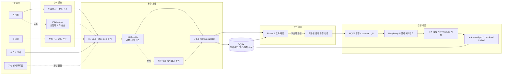

# PetMind 통합 시연 구성도

```mermaid
flowchart LR
    subgraph INPUT[관찰 입력]
        CAM[카메라]
        MIC[마이크]
        SENSOR[온습도 센서]
        SIM[가상 센서 프로필]
    end

    subgraph SIGNAL[인식 신호]
        YOLO[YOLO 시각 분류 신호]
        BARK[짖음 감지·빈도·음량]
        EMOTION[EfficientNet\n실험적 보조 신호]
    end

    subgraph CARE[판단 계층]
        CONTEXT[15~30초 PetContext 집계]
        PROVIDER[LLMProvider\n기본: 규칙 기반]
        SUGGESTION[구조화 CareSuggestion]
        FALLBACK[검증 실패·API 장애 폴백]
    end

    subgraph SAFETY[승인 계층]
        UI[Flutter 보호자 화면]
        POLICY[허용된 음악 유형 검증]
    end

    subgraph ACTION[실행 계층]
        MQTT[MQTT 명령 + command_id]
        PI[Raspberry Pi 장치 에이전트]
        MUSIC[허용 목록 기반 YouTube 재생]
        ACK[acknowledged / completed / failed]
    end

    DB[(SQLite\n센서·제안·액션·실패 사유)]

    CAM --> YOLO --> CONTEXT
    CAM -.보조.-> EMOTION -.-> CONTEXT
    MIC --> BARK --> CONTEXT
    SENSOR --> CONTEXT
    SIM -.개발 환경.-> CONTEXT
    CONTEXT --> PROVIDER --> SUGGESTION
    PROVIDER -.장애.-> FALLBACK --> SUGGESTION
    SUGGESTION --> DB
    SUGGESTION --> UI
    UI -->|보호자 승인| POLICY
    POLICY --> MQTT --> PI
    PI --> MUSIC
    MUSIC --> ACK
    ACK --> DB --> UI
```

LLM은 하드웨어를 직접 제어하지 않는다. 제안에 포함된 허용 액션만 보호자 승인과 코드 기반 안전 정책을 모두 통과한 뒤 실행된다.
